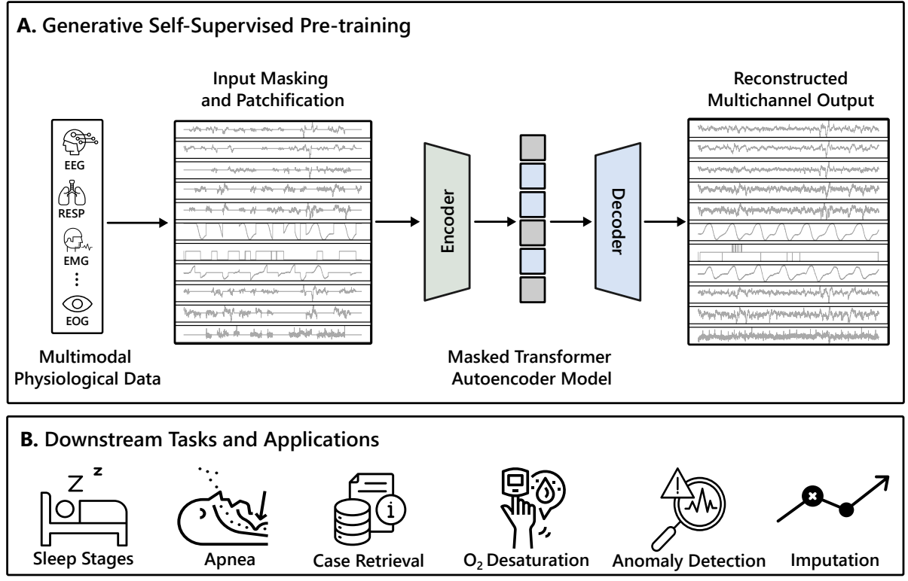
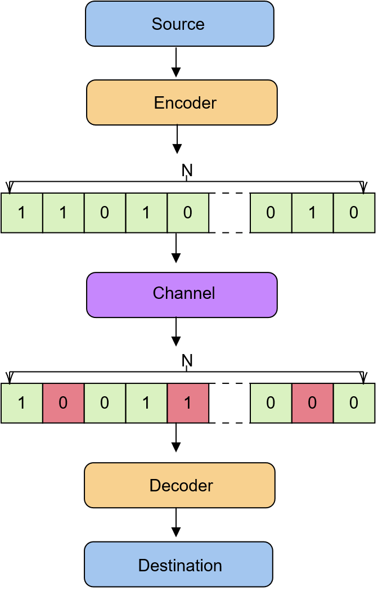
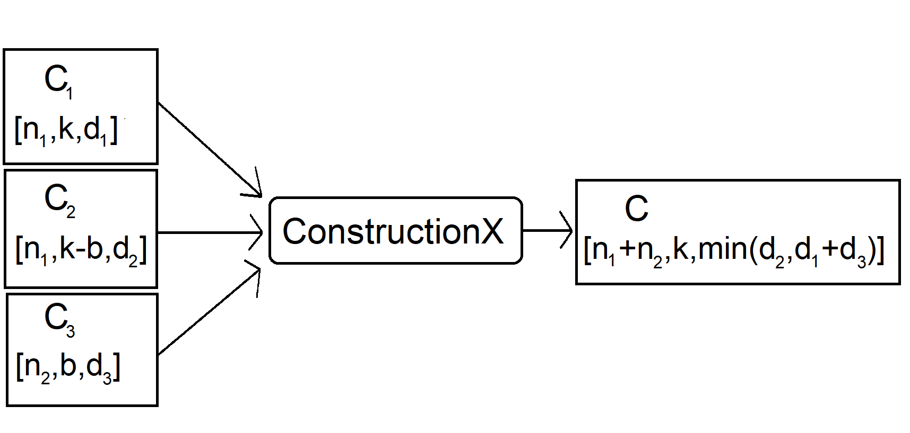
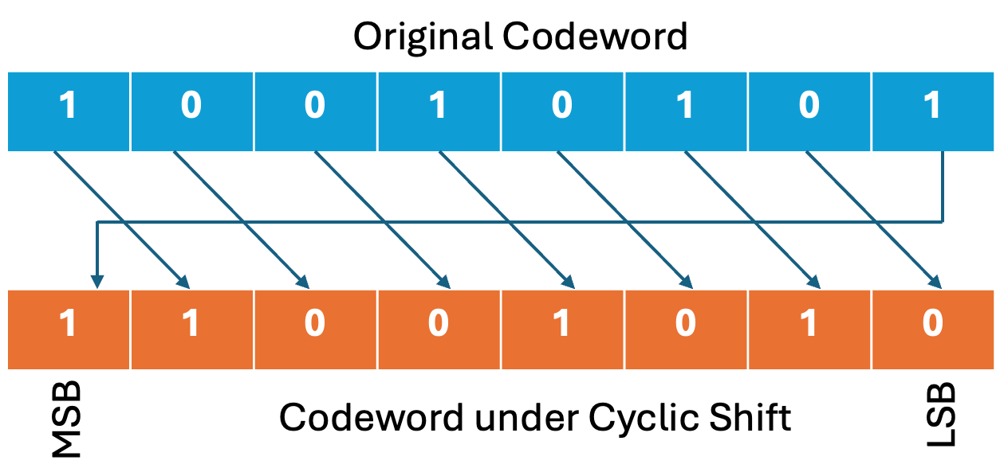

<link rel="stylesheet" href="../assets/css/saurav_custom_css.css">
<title>Saurav Raj Pandey</title>
<h1 class="big-title">👋🏼 Hi there, I'm Saurav!</h1> 

 
👨🏻‍💻 I'm a 3rd year PhD student in the [Department of Computer Science](https://cs.unc.edu./) at the **University of North Carolina at Chapel Hill**, fortunate to be advised by [Dr. Harlin Lee](https://harlinlee.github.io/). 

🔬 Broadly, I'm interested in the applications of <strong>machine learning</strong> to tackle challenges in <strong>healthcare</strong> and improve patient care.

🎓 Prior to starting my PhD, I earned my BA *summa cum laude* from [Kenyon College](https://www.kenyon.edu/) as a double major in Mathematics and Economics (honors) with a Scientific Computing concentration. There, I had the privilege of conducting coding theory research with [Dr. Nuh Aydin](https://www2.kenyon.edu/Depts/Math/Aydin/), discovering new error-correcting codes with desirable properties and parameters. 

🌟 In my free time, I love to play tennis, watch soccer, try out new dishes, and travel!

🤝 I’m always happy to chat about research, explore new internship opportunities, or just discuss life in general. Feel free to reach out!

Latest News
=====
- **[Jun 2025]**: Awarded with Google Cloud Research Credits ($1,000)
- **[May 2025]**: Joined Laboratory for Analaytic Sciences (LAS) for an Applied Data Science internship for Summer 2025
- **[Oct 2024]**: Research talk at 'UNC CompMed's Research in Progress' program
- **[Sep 2024]**: One first-author <a href="https://arxiv.org/abs/2411.00718">paper</a> accepted at [IEEE-EMBS BHI 2024](https://bhi.embs.org/2024/)
- **[May 2024]**: Joined [Cerbrec Inc.](https://cerbrec.com/) as a Deep Learning intern for Summer 2024
- **[Nov 2023]**: 3rd Place: Data Science Week 2023, Purdue University Fort Wayne
- **[Aug 2023]**: Started my PhD at UNC Chapel Hill
 

Research
=====

<table width="100%" align="center" border="0" cellspacing="0" cellpadding="20" id="research">
  <!-- Start of Research Item -->

<tr>
    <td width="35%" valign="top">
      
    </td>
    <td width="65%" valign="center">
      <strong>
        <paper_title>Federated Learning for Epileptic Seizure Prediction Across Heterogeneous EEG Datasets</paper_title>
      </strong>
       Cem Ata Baykara, <u> Saurav Raj Pandey </u>, Ali Burak Unal, Harlin Lee, and Mete Akgun. 
       <em class="venue">In Preparation for Submission</em>
      

        <button onclick="window.location.href='https://arxiv.org/pdf/2508.08159?'">PDF</button>
        <button onclick="window.location.href='https://github.com/sauravpandey123/SeizureFed'">Code</button>
        <button onclick="toggleAbstract('research_item_abs_fedlearning')">Abstract</button>
        

         Developing accurate and generalizable epileptic seizure prediction models from electroencephalography (EEG) data across multiple clinical sites remains challenging due to strict patient-privacy regulations and substantial data heterogeneity (non-IID differences). Federated Learning (FL) provides a privacy-preserving framework for collaborative model training, but standard aggregation methods such as Federated Averaging (FedAvg) are vulnerable to dominance by large or skewed datasets in heterogeneous environments.

          In this work, we investigate FL for seizure prediction using a single EEG channel across four diverse public datasets—Siena, CHB-MIT, Helsinki, and NCH—representing adult, pediatric, and neonatal patient populations with varying recording conditions. We implement privacy-preserving global normalization and introduce a Random Subset Aggregation strategy, in which each client trains on a fixed-size random subset of its data per round, ensuring equal and fair contribution during aggregation.

          Our experiments show that locally trained models fail to generalize across sites, and conventional weighted FedAvg produces highly imbalanced performance (e.g., 89.0% accuracy on CHB-MIT but only 50.8% on Helsinki and 50.6% on NCH). In contrast, Random Subset Aggregation substantially boosts performance on under-represented clients—raising accuracy to 81.7% on Helsinki and 68.7% on NCH—and achieves a superior macro-average accuracy of 77.1% and pooled accuracy of 80.0% across all sites.

          These results demonstrate that balanced aggregation approaches can produce more robust, equitable, and generalizable FL seizure-prediction models in real-world, heterogeneous multi-hospital environments while maintaining data privacy.
        

      

    </td>
  </tr>

<tr>
    <td width="35%" valign="top">
      
    </td>
    <td width="65%" valign="center">
      <strong>
        <paper_title>PedSleepMAE: Generative Model for Multimodal Pediatric Sleep Signals</paper_title>
      </strong>
       <u>Saurav R. Pandey</u>, Aaqib Saeed, Harlin Lee. 
       <em class="venue">IEEE-EMBS International Conference on Biomedical and Health Informatics (BHI’24)</em>
      

        <button onclick="window.location.href='https://arxiv.org/pdf/2411.00718'">PDF</button>
        <button onclick="window.location.href='https://github.com/sauravpandey123/PedSleepMAE'">Code</button>
        <button onclick="toggleAbstract('research_item_abs_pedsleep')">Abstract</button>
        

          Pediatric sleep is an important but often overlooked area in health informatics. We present PedSleepMAE, a generative model that fully leverages multimodal pediatric sleep signals including multichannel EEGs, respiratory signals, EOGs and EMG. This masked autoencoder-based model performs comparably to supervised learning models in sleep scoring and in the detection of apnea, hypopnea, EEG arousal and oxygen desaturation. Its embeddings are also shown to capture subtle differences in sleep signals coming from a rare genetic disorder. Furthermore, PedSleepMAE generates realistic signals that can be used for sleep segment retrieval, outlier detection, and missing channel imputation. This is the first general-purpose generative model trained on multiple types of pediatric sleep signals.
        

      

    </td>
  </tr>

  <tr>
    <td width="35%" valign="top" align="center">
      
    </td>
    <td width="65%" valign="top">
      <strong>
        <paper_title>A Generalization of the ASR Search Algorithm to 2-Generator Quasi-Twisted Codes</paper_title>
      </strong>
       <u>Saurav R. Pandey</u>, Nuh Aydin, Matthew J. Harrington, Dev Akre. 
       <em class="venue">2022 IEEE International Symposium on Information Theory (ISIT)</em>
      

        <button onclick="window.location.href='../papers/isit2022.pdf'">PDF</button>
        <button onclick="toggleAbstract('research_item_abs_2gen')">Abstract</button>
        

      One of the central problems in coding theory is to construct codes with best possible parameters and properties. A special class of codes called quasi-twisted (QT) codes is well-known to produce codes with good parameters. Most of the work on QT codes has been over the 1-generator case. In this work, we focus on 2-generator QT codes and generalize the ASR algorithm that has been very effective to produce new linear codes from 1-generator QT codes. As a result of implementing the generalized algorithm, we have found 103 2-generator QT codes that are new among the class of QT codes. Additionally, most of these codes possess the following additional properties: a) they have the same parameters as best known linear codes, and b) many of them have additional desired properties such as being LCD and dual-containing. Further, we have also found a binary 2-generator QT code that is new (record breaking) among all binary linear codes [1] and its extension yields another record breaking binary linear code. 

      

    </td>
  </tr>

  <tr>
    <td width="35%" valign="top" align="center">
      
    </td>
    <td width="65%" valign="top">
      <strong>
        <paper_title>New binary and ternary quasi-cyclic codes with good properties</paper_title>
      </strong>
       Dev Akre, Nuh Aydin, Matthew J. Harrington, <u>Saurav R. Pandey</u>. 
       <em class="venue">Computational and Applied Mathematics (2023)</em>
      

        <button onclick="window.location.href='../papers/CAM.pdf'">PDF</button>
        <button onclick="toggleAbstract('research_item_abs_CAM')">Abstract</button>
        

      One of the most important and challenging problems in coding theory is to construct codes with best possible parameters and properties. The class of quasi-cyclic (QC) codes is known to be fertile to produce such codes. Focusing on QC codes over the binary field, we have found 113 binary QC codes that are new among the class of QC codes using an implementation of a fast cyclic partitioning algorithm and the highly effective ASR algorithm. Moreover, these codes have the following additional properties: a) they have the same parameters as best known linear codes, and b) many of the have additional desired properties such as being reversible, LCD, self-orthogonal or dual-containing. Additionally, we present an algorithm for the generation of new codes from QC codes using ConstructionX, and introduce 33 new record breaking linear codes over GF(2), GF(3) and GF(5) produced from this method.
 

      

    </td>
  </tr>

  <tr>
    <td width="35%" valign="top" align="center">
      
    </td>
    <td width="65%" valign="top">
      <strong>
        <paper_title>A generalization of cyclic code equivalence algorithm to constacyclic codes</paper_title>
      </strong>
       Dev Akre, Nuh Aydin, Matthew J. Harrington, <u>Saurav R. Pandey</u>. 
       <em class="venue">Designs, Codes and Cryptography (2023)</em>
      

        <button onclick="window.location.href='../papers/DCC.pdf'">PDF</button>
        <button onclick="toggleAbstract('research_item_abs_DCC')">Abstract</button>
      

      Recently, a new algorithm to test equivalence of two cyclic codes has been introduced which is efficient and produced useful results. In this work, we generalize this algorithm to constacyclic codes. As an application of the algorithm we found many constacyclic codes with good parameters and properties. In particular, we found 22 new codes that improve the minimum distances of best known linear codes (BKLCs).
      

      

    </td>
  </tr>

  <!-- End of Research Item -->
</table>

 

Selected Honors and Awards
====
- **UNC AI Acceleration Microsoft Azure Cloud Resource Grant ($30,000)** (2025)
- **Google Cloud Research Credits ($1,000)** (2025)
- **IEEE BHI'24 NSF Student Travel Award** (2024)
- **3rd Place: Posters and Short Talk, Data Science Week, Purdue University Fort Wayne** (2023)
- **Phi Beta Kappa Academic Honor Society** (2022-present)
- **Sigma Xi Scientific Research Honor Society** (2023)
- **Kenyon College Merit List (8x)** (2019-2023)
- **2nd place: Kenyon Programming Contest** (2022)
- **1st place: Kenyon Programming Contest** (2021)

